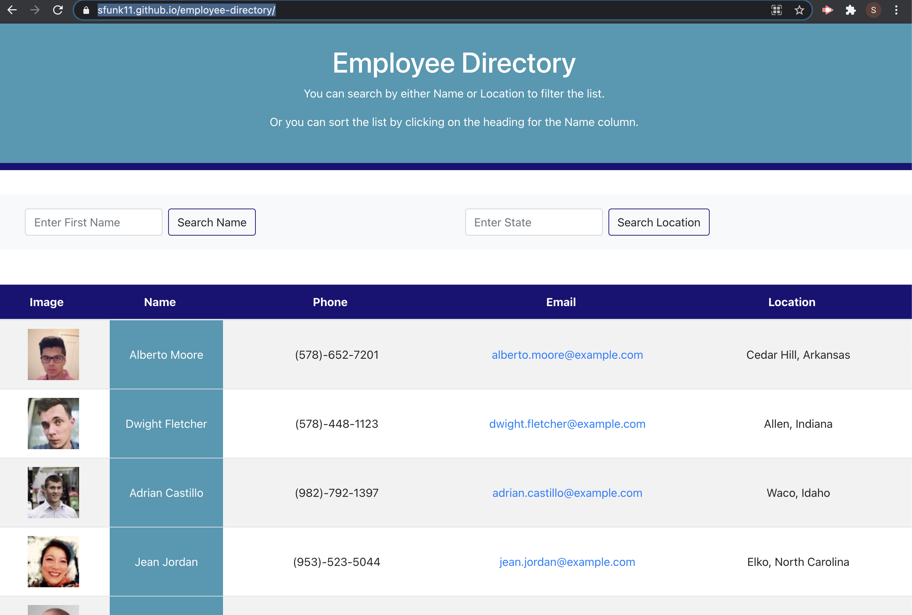

# React Employee Directory
## Description
 This is a simple React application that populates a list of randomly generated users, including their picture, name, phone number, email address, and location.  This list can be filtered by either name or location, and can be sorted by name.
 
  [Link to Deployed Application](https://sfunk11.github.io/employee-directory/)
  
  
  
  ## Table of Contents
  * [Installation](#installation)
  * [Languages and Technologies Used](#languages)
  * [Questions](#questions)
  
  ## Installation
 - assuming node and npm are installed. 

```shell
$ git clone git@github.com:sfunk11/employee-directory.git
$ cd employee-directory/
$ npm i
```
  ### Screenshots
  
  


  ## Languages and Technologies Used
  * React
  * Javascript
  * Deployed to GitHub pages
  * Node.js and packages:
    * create-react-app
    * axios
    * bootstrap
    * gh-pages
    

  
  ## Questions
  If you have any questions, please send them to me through GitHub or email.

  Github Username: sfunk11

  [borley1@gmail.com](mailto:borley1@gmail.com)

